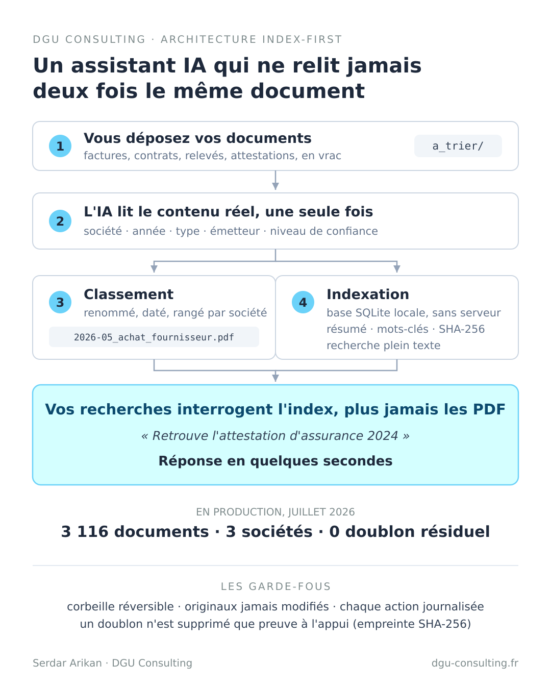

# Kit assistant documentaire IA

Confiez le classement des documents de votre entreprise à un assistant IA, sans jamais perdre le contrôle.

Ce kit installe, en une demi-journée, un assistant capable de lire, classer, renommer, indexer et retrouver l'ensemble de vos documents administratifs : factures, contrats, relevés, attestations, déclarations. Il repose sur un principe simple : des règles strictes posées avant la première action, et un index local pour que chaque document ne soit lu qu'une seule fois.

Il est utilisé en production sur trois sociétés réelles : plus de 3 100 documents indexés, zéro doublon résiduel, zéro document fantôme.

## Pour qui

- Dirigeants de TPE/PME, indépendants, professions libérales, avec une ou plusieurs structures
- Aucune compétence technique requise : l'assistant vous guide, vous répondez à ses questions
- Prérequis : un abonnement Claude (l'offre Pro suffit) et vos documents dans un dossier, même en désordre. Surtout en désordre.

## Comment ça marche



Chaque document est lu une seule fois, puis qualifié, renommé, classé et indexé dans une petite base locale. Ensuite, vos recherches interrogent l'index et répondent en quelques secondes, sans jamais relire les documents.

## L'architecture cible

**Le point le plus important de toute l'installation :** l'assistant s'exécute à la racine d'un dossier unique qui contient TOUTES vos structures. C'est cette vue d'ensemble qui lui permet de router chaque document vers la bonne société et de tenir un index unique.

```
Documents/                       ← Claude Code s'ouvre ICI, à la racine
├── CLAUDE.md                    ← les instructions permanentes
├── 00_CONTEXTE/                 ← contexte, règles, journal, index
├── SOCIETE_EXPLOITATION/        ← votre société principale
│   ├── a_trier/   a_valider/   a_supprimer/   archives/
│   ├── 01_Societe/
│   └── 02_Comptabilite/2026/factures/2026-07/
├── HOLDING/                     ← si vous en avez une
│   └── (même structure)
└── SCI/                         ← si vous en avez une
    └── (même structure)
```

Une seule structure ? Même principe, avec un seul dossier de société. L'installation guidée (DEMARRAGE.md) crée tout cela pour vous, aux vrais noms de vos structures.

## Démarrer en 3 étapes

1. **Installez Claude Code** et connectez-vous avec votre compte Claude. Le pas à pas illustré, pour Windows et macOS, est dans [INSTALLATION.md](INSTALLATION.md).
2. **Téléchargez ce kit** : bouton vert « Code » en haut de cette page, puis « Download ZIP ». Dézippez-le où vous voulez. (Les habitués peuvent cloner le dépôt.)
3. **Ouvrez Claude Code dans le dossier du kit et collez cette phrase :**

```
Lis le fichier DEMARRAGE.md et guide-moi pas à pas.
```

C'est tout. L'assistant mène l'entretien : vos sociétés, votre banque, votre cabinet comptable, vos types de documents. Il remplit le dossier de contexte, crée l'arborescence, adapte ses propres instructions, puis vous propose un premier tri supervisé sur une vingtaine de documents.

## Les garde-fous

L'assistant travaille sous des règles non négociables, détaillées dans [docs/securite.md](docs/securite.md) :

- il ne supprime jamais rien définitivement : tout passe par la corbeille, réversible
- il ne modifie et n'écrase jamais un document original
- il journalise chaque action, datée, dans un fichier que vous pouvez relire
- un doublon n'est déclaré doublon que preuve à l'appui (empreinte SHA-256), jamais sur la foi du nom
- il lit le contenu réel de chaque document avant de le classer
- il n'invente jamais une information absente des documents, et distingue toujours faits confirmés, hypothèses et points à faire valider
- il ne remplace ni votre expert-comptable, ni votre avocat

## Le coût, honnêtement

- L'abonnement Claude Pro (environ 20 euros par mois) suffit pour un usage courant.
- **Le premier passage sur votre historique est le moment coûteux** : chaque document est lu une fois, ce qui prend du temps et consomme une bonne part du quota de votre abonnement. C'est normal, et cela n'arrive qu'une seule fois. L'assistant vous proposera de traiter l'historique par lots, sur plusieurs sessions ; si vous atteignez la limite de votre abonnement, le travail déjà fait est conservé, vous reprenez plus tard.
- Ensuite, seuls les nouveaux documents sont lus : quelques secondes, coût marginal.

## Aller plus loin

Une fois le système en rythme de croisière, deux extensions ont fait leurs preuves :

- **Rapprochement bancaire** : si votre banque expose une API (Qonto, par exemple), l'assistant peut rapprocher chaque facture de sa transaction, en lecture seule. Jamais d'écriture, jamais de virement.
- **Relecture des documents de synthèse** : confrontez le bilan préparé par votre cabinet aux pièces indexées. Un second regard qui a tout sous la main ; la validation reste celle de votre expert-comptable.

Le retour d'expérience complet, avec l'architecture et les chiffres, est ici : [Un assistant documentaire IA pour trois sociétés](https://dgu-consulting.fr/blog/assistant-documentaire-ia).

## Besoin d'aide

Vous voulez le mettre en place sans vous en occuper, l'adapter à votre situation, ou simplement en parler avant de vous lancer ?

**Point IT offert, 30 minutes en visio, sans engagement :** [réserver un créneau](https://calendly.com/serdar-arikan-dgu-consulting/30min)

Serdar Arikan · [DGU Consulting](https://www.dgu-consulting.fr) · [LinkedIn](https://www.linkedin.com/in/serdar-arikan)

## Licence

[MIT](LICENSE). Utilisez, adaptez, partagez librement.
