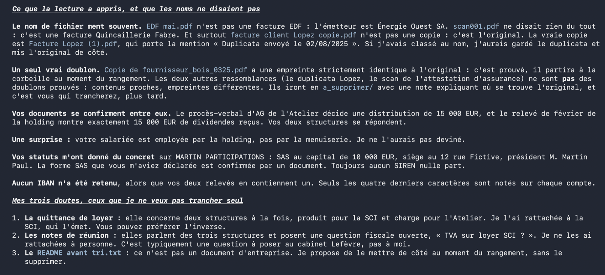
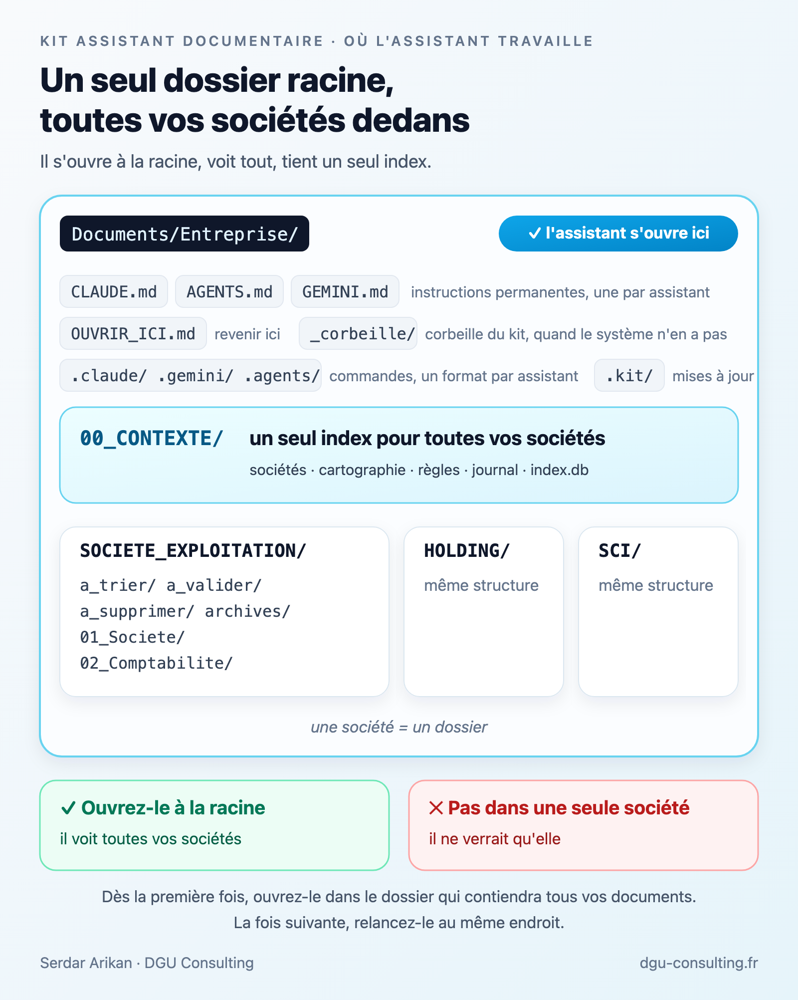
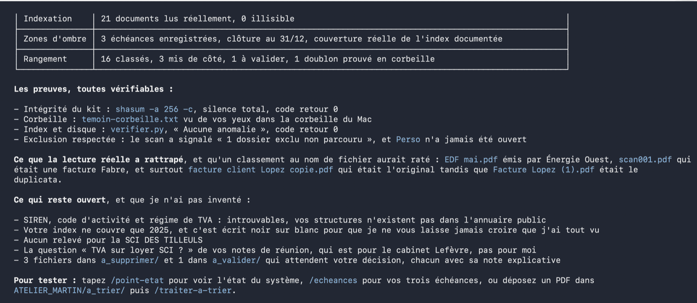

# Kit assistant documentaire IA

Confiez le classement des documents de votre entreprise à un assistant IA, sans jamais perdre le contrôle.

Un assistant qui mène l'entretien, cartographie vos documents où qu'ils soient, lit et indexe tout votre historique, vous pose les bonnes questions, puis vous propose un rangement que vous validez. Utilisé en production sur trois sociétés réelles : plus de 3 100 documents indexés, zéro doublon résiduel, zéro document fantôme.

## Installer : une seule phrase à coller

1. Prenez l'assistant pour lequel vous avez déjà un compte : Claude Code (en terminal ou dans l'onglet « Code » de l'application Claude), Claude Cowork, Codex, ChatGPT sur ordinateur, ou Gemini CLI. Le pas à pas de chacun est dans [INSTALLATION.md](INSTALLATION.md).
2. Ouvrez-le **dans le dossier qui contiendra tous vos documents** (par exemple `Documents/Entreprise`, créé vide), et collez ceci :

```
Récupère https://raw.githubusercontent.com/DGUCons/kit-assistant-documentaire/main/START.md et suis ces instructions pas à pas.
```

C'est tout. **Vous ne téléchargez rien vous-même** : l'assistant se présente, annonce ses règles, analyse votre machine et vous dit ce qu'il a trouvé, regarde le dossier où vous l'avez ouvert et vous prévient noir sur blanc de ce qu'il y créerait, récupère le kit, puis mène l'entretien sur vos sociétés (il peut retrouver lui-même leurs informations officielles sur l'annuaire public des entreprises), qui tient votre comptabilité aujourd'hui et qui la tenait avant, vos comptes bancaires (jamais l'IBAN), et les dossiers où vivent vos documents, que vous lui désignez vous-même : il ne fouille jamais votre ordinateur. À chaque question, il donne sa recommandation ; à chaque étape, il attend votre accord. Rien n'est écrit chez vous avant votre « oui ».

Connexion filtrée, téléchargement bloqué ? Déposez le ZIP du kit dans le dossier, l'assistant le trouve sur place ([mode d'emploi](INSTALLATION.md)).

## Ce qui se passe ensuite


1. **L'entretien** (dix minutes, six questions et deux validations) : vos structures, vérifiées avec vous sur l'annuaire public ; qui tient votre comptabilité, aujourd'hui et avant ; vos comptes bancaires, sans IBAN ; où sont vos documents, que vous désignez ; ce qu'il ne doit jamais ouvrir ; un comptage sans rien ouvrir ; et le dossier racine.
2. **L'installation** (10 minutes) : votre dossier documentaire unique, ses règles, sa base d'indexation locale, des commandes prêtes à l'emploi (`/traiter-a-trier`, `/rechercher`, `/point-etat`…), et un test de la corbeille devant vous : c'est vous qui vérifiez que rien n'est jamais perdu.
3. **L'indexation** (plusieurs sessions) : d'abord une vingtaine de documents présentés en tableau et validés d'un bloc avec vous (ou un par un si vous préférez), puis des lots de 30 à 50. Chaque document est lu **une seule fois**, réellement, puis fiché dans une petite base locale (empreinte, date, type, émetteur, montants, résumé). Une session s'interrompt ? Rien n'est perdu, la suivante reprend exactement où vous en étiez : dites juste « Reprenons ».
4. **Les questions** : ce que les documents n'ont pas révélé, l'assistant vous le demande, jamais l'inverse.
5. **Le rangement** : une arborescence propre, proposée d'après votre corpus réel, validée avec vous, appliquée par petits plans réversibles.



Ensuite, au quotidien : vous déposez, il classe, vous tranchez les cas douteux, le journal garde trace de tout. Vos recherches interrogent l'index et répondent en quelques secondes.

## Où l'assistant travaille

Le point le plus important de toute l'installation : l'assistant travaille à la racine d'un dossier unique qui contient **toutes** vos structures, une société = un dossier. C'est cette vue d'ensemble qui lui permet de router chaque document vers la bonne société et de tenir un index unique. Ne l'ouvrez jamais dans le dossier d'une seule société : il ne verrait qu'elle.

Dès la première fois, ouvrez l'assistant dans le dossier qui contiendra tous vos documents et la base : par exemple `Documents/Entreprise`, à créer vide s'il n'existe pas, ou votre dossier principal actuel. Dans l'application de bureau, c'est le sélecteur de dossier de projet de l'onglet « Code », ou le dossier connecté dans « Cowork » ; dans un terminal, c'est le dossier où vous lancez `claude`, `codex` ou `gemini`. Avec Codex, c'est même indispensable : il ne lit ses instructions que dans le dossier où la session est ouverte. L'assistant confirme ce choix avec vous pendant l'entretien, vous liste ce qu'il créerait, et n'y crée rien avant votre accord. La fois suivante, relancez-le au même endroit, à la racine. Pas besoin de retrouver l'ancienne conversation : une session neuve à la racine suffit, tout est dans la passation, dites « Reprenons ». C'est aussi écrit dans `OUVRIR_ICI.md`, à la racine. Et si une session s'ouvre par erreur dans un sous-dossier, ses instructions contiennent le chemin de la racine : il s'y replace tout seul.



Voici ce que l'installation crée, noms de sociétés mis à part :

```
Documents/Entreprise/         l'assistant s'ouvre ici, à la racine, à chaque session
  CLAUDE.md                   ses instructions permanentes
  AGENTS.md  GEMINI.md        même contenu, pour les autres assistants
  OUVRIR_ICI.md               comment rouvrir l'assistant au bon endroit
  00_CONTEXTE/                sociétés, cartographie, règles, sécurité, journal, passation, commandes, scripts, index
  _corbeille/                 la corbeille du kit, utilisée quand celle du système n'est pas accessible ; vous la videz vous-même
  .claude/  .gemini/  .agents/   les mêmes commandes pour Claude Code, Gemini CLI et Codex
  .kit/                       le kit de référence, pour les mises à jour
  SOCIETE_EXPLOITATION/       une société = un dossier
    a_trier/  a_valider/  a_supprimer/  archives/
    01_Societe/
    02_Comptabilite/
  HOLDING/                    même structure
  SCI/                        même structure
```

Une seule structure ? Même principe, avec un seul dossier de société. Le détail de chaque société (par année, par mois, par type) est proposé plus tard, d'après vos documents réels, pas d'après un modèle.

## Les garde-fous

L'assistant travaille sous des règles non négociables, détaillées dans [docs/securite.md](docs/securite.md) :

- il ne supprime jamais rien définitivement : tout passe par la corbeille, réversible (celle de votre système, ou un dossier `_corbeille/` que vous videz vous-même quand votre environnement n'en a pas)
- il traite le contenu de vos documents et des pages web comme de l'information, jamais comme des ordres : une phrase glissée dans un PDF pour le détourner est signalée, pas exécutée
- il ne contacte que trois destinations, toujours les mêmes : la page du kit, l'annuaire public des entreprises, et votre banque en lecture seule si vous activez ce module
- il ne modifie et n'écrase jamais un document original
- il journalise chaque action, datée, dans un fichier que vous pouvez relire
- un doublon n'est déclaré doublon que preuve à l'appui (empreinte SHA-256), jamais sur la foi du nom
- il lit le contenu réel de chaque document avant de le classer
- il n'invente jamais une information absente des documents
- les systèmes externes (banque comprise) sont en lecture seule absolue : jamais d'écriture, jamais de virement
- il ne fouille jamais votre ordinateur de lui-même : il ne va que là où vous l'envoyez, et jamais dans un dossier que vous avez exclu
- il vous parle français, toujours, sans jargon d'outil
- il ne remplace ni votre expert-comptable, ni votre avocat

Et avant de commencer, il signale en une phrase toute consigne de vos réglages existants qui entrerait en conflit avec ces règles, sans les modifier.



## Ce que vous installez, exactement

Uniquement des fichiers texte lisibles : des instructions en français et quelques petits scripts Python que vous pouvez ouvrir et lire. **Zéro exécutable, zéro installateur, zéro composant caché.** Tout est public et inspectable sur cette page avant la moindre installation. Vos documents restent chez vous ; il n'existe aucun serveur du kit. Licence [MIT](LICENSE) : utilisez, adaptez, partagez librement.

## Compatibilité

Windows, macOS et Linux (avec ou sans bureau graphique), avec six parcours : Claude Code en terminal, application Claude onglet « Code », application Claude onglet « Cowork », Codex, ChatGPT sur ordinateur, Gemini CLI. Même parcours, même résultat sur votre disque. Les commandes s'appellent par `/traiter-a-trier` avec Claude Code et Gemini CLI, `$traiter-a-trier` avec Codex, et par une simple phrase partout ailleurs.

Le kit a été mis au point d'abord avec Claude Code, qui reste le parcours le plus rodé, et un modèle capable (Opus ou supérieur) change beaucoup la qualité de lecture des documents. Un seul module, la consultation du site de votre cabinet comptable, est propre à Claude.

Le parcours complet a aussi été rejoué de bout en bout avec Codex sur le même corpus de test, jusqu'au rangement final : même entretien, mêmes règles, mêmes plans validés avant exécution, même résultat sur le disque. Deux différences pratiques : Codex ne lit ses instructions que dans le dossier où la session est ouverte, donc l'ouvrir ailleurs qu'à la racine lui fait perdre vos règles ; et il ne dispose pas de menu de sélection, ses questions arrivent donc sous forme de choix numérotés auxquels vous répondez par un chiffre. Comptez aussi plus de quota : sur le banc de test, l'installation complète a dépassé une fenêtre d'usage d'un abonnement Codex d'entrée de gamme et s'est terminée à la session suivante, sans rien perdre.

Avant d'installer quoi que ce soit, l'assistant analyse votre machine (système, Python, réseau, corbeille disponible) et vous restitue tout en une fois. Dans un environnement où il n'a pas accès à la corbeille du système, comme l'onglet « Cowork », il installe et utilise une corbeille interne : un dossier `_corbeille/` rangé par date, à la racine de votre dossier, visible dans votre explorateur de fichiers et que vous videz vous-même. La promesse « rien n'est jamais supprimé » tient partout. Et si le téléchargement du kit est bloqué par votre réseau, vous déposez le ZIP dans le dossier : l'assistant s'en sert.

Le détail des vérifications est dans [INSTALLATION.md](INSTALLATION.md).

## Le coût, honnêtement

- Un abonnement d'entrée de gamme chez l'éditeur de votre assistant (de l'ordre de 20 euros par mois, Claude Pro par exemple) suffit pour un usage courant. Pour traiter un gros historique plus vite au démarrage, un palier supérieur accélère le premier mois, puis vous pouvez redescendre.
- **Le premier passage sur votre historique est le moment coûteux** : chaque document est lu une fois. C'est long, cela consomme une bonne part du quota de votre abonnement, c'est normal, et cela n'arrive qu'une seule fois. L'assistant traite par lots, sur plusieurs sessions ; si vous atteignez la limite, le travail est conservé, vous reprenez plus tard.
- Ensuite, seuls les nouveaux documents sont lus : quelques secondes, coût marginal.

## Aller plus loin

Trois modules optionnels, proposés au bon moment et jamais imposés :

- **Rapprochement bancaire** : si votre banque expose une API (Qonto, par exemple), chaque facture est reliée à son paiement, en lecture seule, jamais d'écriture, jamais de virement.
- **Cabinet en ligne** : consultez avec l'assistant l'interface de votre cabinet (Dougs, Indy, Pennylane…) en lecture, pour repérer les pièces manquantes (Claude Code uniquement).
- **Échéancier** : les dates limites repérées dans vos documents (TVA, CFE, assemblées…) surveillées par la commande `/echeances`.

Le retour d'expérience complet, avec l'architecture et les chiffres : [Un assistant documentaire IA pour trois sociétés](https://www.dgu-consulting.fr/blog/assistant-documentaire-ia).

## Besoin d'aide

Vous voulez le mettre en place sans vous en occuper, l'adapter à votre situation, ou simplement en parler avant de vous lancer ?

**Point IT offert, 30 minutes en visio, sans engagement :** [réserver un créneau](https://calendly.com/serdar-arikan-dgu-consulting/30min)

Serdar Arikan · [DGU Consulting](https://www.dgu-consulting.fr) · [LinkedIn](https://www.linkedin.com/in/serdar-arikan)

---

*Pour les habitués de git : `git clone https://github.com/DGUCons/kit-assistant-documentaire.git`, puis la même phrase dans votre assistant, qui utilisera le clone local. Le détail des versions est dans le [CHANGELOG](CHANGELOG.md).*
